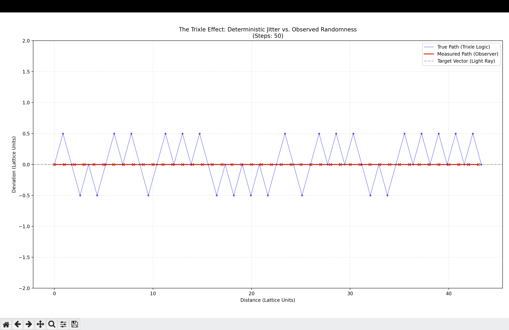

# The Trixle Project: A Tetrahedral Lattice Simulation
**Exploring "Quantum Randomness" as Geometric Latency in Discrete Space.**

 

## 🧐 What is this?
The **Trixle Project** is a computational experiment in discrete geometry. 


It simulates a universe composed of a dense packing of regular tetrahedra ("Trixles"). Because regular tetrahedra cannot tile 3D space perfectly (leaving a recurring **7.36° angular deficit**), a particle moving through this lattice cannot travel in a straight line. It is forced to "jitter" or weave through the geometric gaps.

**The Hypothesis:**
> If we simulate a deterministic path through a "frustrated" tetrahedral graph, the resulting trajectory produces data **observationally equivalent** to the Heisenberg Uncertainty Principle.

## 🚀 Key Concepts

### 1. The Geometry (The Hardware)
The simulation treats space as a **Distributed Graph Database**.
* **Nodes:** Regular Tetrahedra.
* **The Bug:** The packing efficiency limit is ~85.63%. The remaining ~14% is "Void Space" or "System Latency."

### 2. The Jitter (The Software)
When a "Signal" (Particle) moves from Node A to Node B, it attempts to follow a straight vector.
* Since no straight path exists in the lattice, the Signal must choose the "Next Best Neighbor."
* This forces a micro-zig-zag motion.
* To a macroscopic observer, this deterministic zig-zag appears as **random probabilistic noise**.

## 🛠️ Quick Start

1. Install dependencies:
   ```bash
   pip install -r requirements.txt